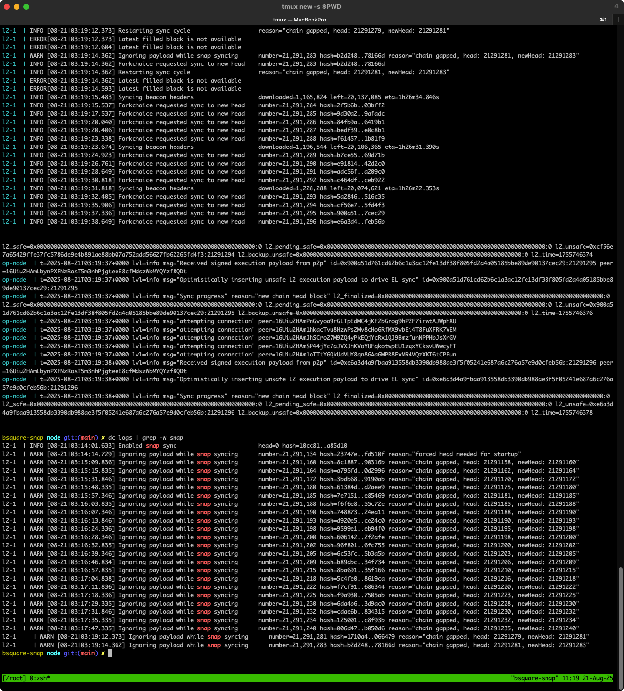

Deployment is similar to the previous two articles, with the following differences:
1. No need to download snapshot data.
1. Start the node with snap sync to quickly bring up a usable node.

# Steps
1. Download the following files:
    - [genesis.json](genesis.json)
    - [rollup.json](rollup.json)
    ```bash
    bsquare-snap data git:(main) ✗ ls *.json | xargs sha1sum
    21248ccd9515c620b8440b3c2f53fbca0e8a3d2a  genesis.json
    094b023b962645933894185ff4d9f568edd3865b  rollup.json
    ```
1. Create a docker-compose.yml file，referring to [Setup B2 Node](running_rollup_node.md#setup-b2-node)
2. Start the container `us-docker.pkg.dev/oplabs-tools-artifacts/images/op-geth:v1.101315.2` and run `geth init genesis.json`  to initialize the node, remember to persist the data( default path `/root/.ethereum`)
3. Configure environment variables:
   1. op-geth: `GETH_SYNCMODE=snap`
   1. op-node: `OP_NODE_SYNCMODE=execution-layer`
4. `docker compose up -d` to start the node.
5. 